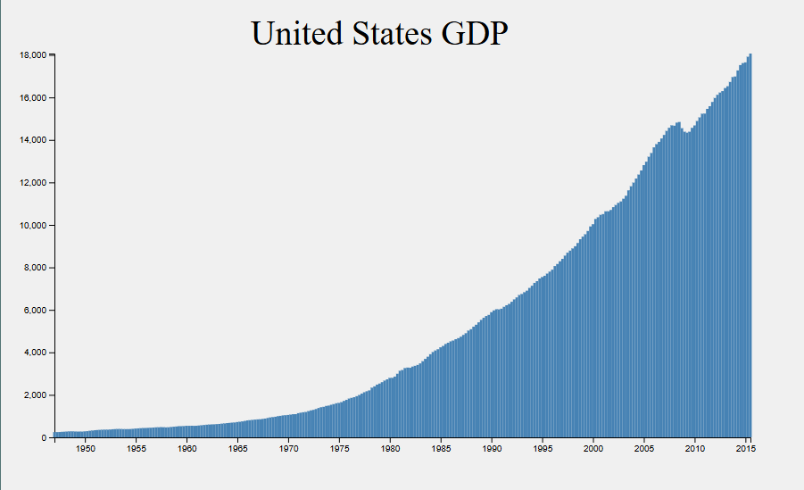

# 📊 Bar Chart with D3.js

This is a simple bar chart built using D3.js. It visualizes a set of sample data and demonstrates how to use D3 scales, axes, and SVG rectangles.

## 💡 Features
- Scaled Y-axis, X-axis based on data
- Animated bar rendering

## 🔧 Technologies
- HTML
- CSS
- JavaScript
- D3.js v7.9.0

## 📷 Preview

## 🔗 Live Demo

[Click here to view the live project](https://your-username.github.io/bar-chart-d3)

